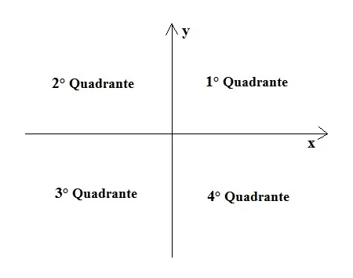

# Desafios e soluções da [dio.me](https://www.dio.me/)

## Aceleração Avanade - Microsserviços com Java

### Desafios teste de aprovação para participação no evento

Nesta pasta você encontrará desafios de teste de aprovação para participação na Aceleração Avanade - Microsserviços com Java" da [dio.me](https://www.dio.me/).

Sugestão: evite copiar e colar, a ideia dos desafios é que você os enfrente, então se na dificuldade chegou até esse ponto, aproveite para ver como resolvi o desafio e como posso melhorar, a análise é mínima a ser feito.

Abaixo estão os links para os desafios:

	<table border=1>
		<tr>
			<th colspan="4">Aceleração Avanade - Microsserviços com Java</th>
		</tr>
		<tr>
			<th>Etapa</th>
			<th>Desafio</th>
			<th>Solução</th>
			<th>Status</th>
		</tr>
		<tr>
			<td align="center">1</td>
			<td>Quadrante</td>
			<td>
				<a href="https://github.com/didifive/desafios-dio/blob/master/desafios/Java/Acelera%C3%A7%C3%A3o%20Avanade%20-%20Microsservi%C3%A7os%20com%20Java/Quadrant.java">
					Código
				</a>
			</td>
			<td align="center">✅</td>
		</tr>
		<tr>
			<td align="center">2</td>
			<td>Múltiplos de 13</td>
			<td>
				<a href="https://github.com/didifive/desafios-dio/blob/master/desafios/Java/Acelera%C3%A7%C3%A3o%20Avanade%20-%20Microsservi%C3%A7os%20com%20Java/MultiplesOf13.java">
					Código
				</a>
			</td>
			<td align="center">✅</td>
		</tr>
		<tr>
			<td align="center">3</td>
			<td>Blobs</td>
			<td>
				<a href="https://github.com/didifive/desafios-dio/blob/master/desafios/Java/Acelera%C3%A7%C3%A3o%20Avanade%20-%20Microsservi%C3%A7os%20com%20Java/Blobs.java">
					Código
				</a>
			</td>
			<td align="center">✅</td>
		</tr>
	</table>

### Desafio 1/3 - Quadrante

**Desafio**  
O plano cartesiano é feito por uma quantidade indeterminada de pontos. Ele é composto por quatro quadrantes como mostra a imagem abaixo. Desenvolva um programa que, dada as coordenadas de entrada (x, y), verifique em qual quadrante está situado o ponto.

Caso uma das coordenadas seja NULA, o programa deve parar.

**Entrada**  
As entradas serão 2 valores inteiros.

**Saída**  
Para cada caso de teste mostre em qual quadrante do sistema cartesiano se encontra a coordenada lida, conforme o exemplo.

| Exemplo de Entrada | Exemplo de Saída |
|--------------------|------------------|
| 2 2                | primeiro         |
| 3 -2               | quarto           |
| -8 -1              | terceiro         |
| -7 1               | segundo          |
| 0 2                |                  |

### Desafio 2/3 - Múltiplos de 13

**Desafio**  
Escreva um algoritmo que leia 2 valores inteiros A e B calcule a soma dos números que não são múltiplos de 13 entre A e B, incluindo ambos.

**Entrada**  
O arquivo de entrada contém 2 valores inteiros quaisquer, não necessariamente em ordem crescente.

**Saída**  
Imprima a soma de todos os valores não divisíveis por 13 entre os dois valores lidos na entrada, inclusive ambos se for o caso.

Exemplo
Exemplo de entrada 	Exemplo de saída 
100						
200

| Exemplo de Entrada | Exemplo de Saída |
| ---                | ---              |
| 100                | 13954            |
| 200                |                  |

### Desafio 3/3 - Blobs

**Desafio**  
No planeta Alpha vive a criatura Blobs, que come precisamente 1/2 de seu suprimento de comida disponível todos os dias. Escreva um algoritmo que leia a capacidade inicial de suprimento de comida, e calcule quantos dias passarão antes que Blobs coma todo esse suprimento até restar um quilo ou menos.

**Entrada**  
A primeira linha de entrada contem um único inteiro N (1 ≤ N ≤ 1000), indicando o número de casos de teste. As N linhas seguintes contém um valor de ponto flutuante C (1 ≤ C ≤ 1000) correspondente à quantidade de comida disponível para Blobs.

**Saída**  
Para cada caso de teste, imprima uma linha contendo o número de dias que Blobs irá demorar para comer todo seu suprimento de comida, seguido da palavra "dias".

| Exemplo de Entrada | Exemplo de Saída |
|--------------------|------------------|
| 3                  | 6 dias           |
| 40.0               | 8 dias           |
| 200.0              | 9 dias           |
| 300.0              |                  |